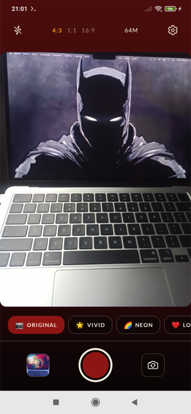
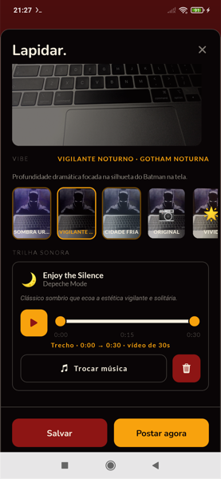
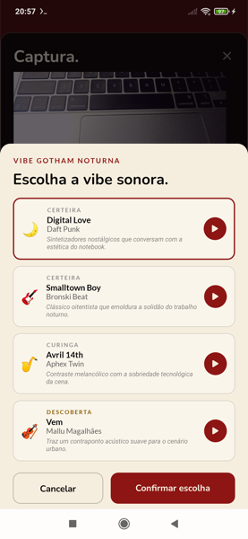
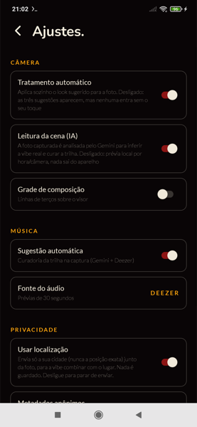
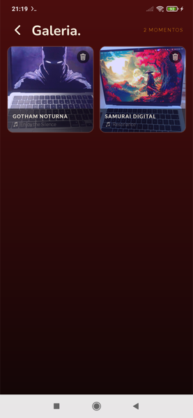
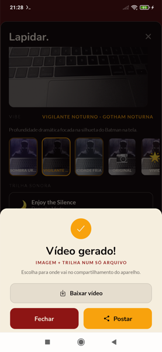

<div align="center">

# 🎨 Synesthesia — App

### Uma nova forma de ver o mundo através da câmera

[](https://www.fiap.com.br)
[](https://expo.dev)
[](https://reactnative.dev)
[](https://www.typescriptlang.org)

</div>

---

## 📖 Sobre

**Synesthesia** é o app mobile da equipe **SAVAC** para o **JOVI Challenge — FIAP 2026**. Ele redefine a câmera do smartphone como uma experiência **multimodal e contextual**: traduz automaticamente o contexto visual de uma cena em **filtros** e **trilha sonora** harmônicos, entregando um "pacote sensorial" (foto + filtro + música) pronto para compartilhar — com o mínimo de atrito de decisão.

Este repositório é a evolução **mobile (Expo / React Native)** do MVP funcional em terminal entregue na disciplina de Python. Para o estado atual do projeto (feature ativa, versão, o que falta), veja [`docs/ESTADO.md`](docs/ESTADO.md) — é o ponto de entrada da documentação.

## ✨ Pilares

1. **Inteligência Contextual e Adaptativa** — a "vibe" do visor é recalculada em tempo real (inclusive ao virar a câmera) e o filtro é aplicado ao vivo. Ao capturar, a cena real (lida pelo Gemini) substitui a tabela fixa `vibe → filtro` por **três looks sugeridos**, com o principal já aplicado sem toque — e o app aprende o gosto visual de quem usa, sem nada disso passar pela rede.
2. **Fusão entre Atmosfera e Som** — imagem e música formam um único pacote sensorial no momento da captura.
3. **Ciclo de Vida da Mídia** — galeria inteligente que preserva a intenção criativa: revisite, lapide e exporte.

## 📱 Preview

Capturas reais da versão em produção (1.3.0), tiradas em dev build no Redmi Note 8 Pro:

<div align="center">



</div>

<div align="center">



</div>

<div align="center">
<sub><b>Câmera</b> — visor ao vivo, carrossel de 8 filtros locais · <b>Captura</b> — vibe lida pelo Gemini ("Vigilante Noturno · Gotham Noturna") e a trilha já curada · <b>Trocar Música</b> — quatro sugestões com papel (certeira/curinga/descoberta) e justificativa · <b>Ajustes</b> — leitura da cena e localização, ambas opt-in e revogáveis · <b>Galeria</b> — momentos persistidos com vibe e trilha, reabrir não refaz a curadoria · <b>Postagem</b> — imagem + trilha num só `.mp4`, pronto para a folha de compartilhamento do sistema</sub>
</div>

Mais capturas em [`docs/previews/1.3.0/`](docs/previews/1.3.0/). A cada release, a pasta da versão
atual substitui a anterior — ver [`docs/previews/README.md`](docs/previews/README.md).

## 📦 Baixar o APK

Não precisa compilar nada para testar no Android: o [release mais recente](https://github.com/SAVAC-Challenge-FIAP/synesthesia-app/releases/latest) traz um APK assinado, pronto para instalar.

1. Baixe o `.apk` do [release](https://github.com/SAVAC-Challenge-FIAP/synesthesia-app/releases/latest) pelo próprio celular.
2. Abra o arquivo — o Android vai pedir para permitir instalação de fonte desconhecida, o que é normal para app fora da loja.
3. Na primeira abertura, conceda câmera e galeria.

Android 7+, qualquer aparelho ARM.

## 🚀 Como rodar (Expo Go)

Pré-requisitos: Node 20+, celular com o app **Expo Go** ([Android](https://play.google.com/store/apps/details?id=host.exp.exponent) / [iOS](https://apps.apple.com/app/expo-go/id982107779)) na mesma rede Wi-Fi do computador.

```bash
npm install
npx expo start
```

Escaneie o QR code exibido no terminal: no **Android**, pelo próprio app Expo Go; no **iOS**, pela câmera do sistema. Se a rede bloquear a conexão local (Wi-Fi corporativo/universidade), use `npx expo start --tunnel`.

Chaves de API são **opcionais** (o Deezer não exige chave): copie `.env.example` para `.env` para habilitar a curadoria via Gemini.

### ⚠️ Adaptações para Expo Go

O Expo Go não carrega módulos nativos fora do SDK. Para validação imediata no celular, esta versão substitui parte da stack final por equivalentes compatíveis, mantendo os contratos da arquitetura:

| Arquitetura final | Nesta versão (Expo Go) |
|---|---|
| `react-native-vision-camera` | `expo-camera` |
| ML Kit (rotulagem de cena on-device) | Vibe simulada on-device (`src/services/vibeEngine.ts`) — mesmo contrato `detectVibe() → Vibe` |
| Skia (shaders GPU) | Carga opcional (`src/services/skiaBridge.ts`): usa `@shopify/react-native-skia` quando o dev build já foi regerado com o módulo nativo; sem isso, cai para overlays + style `filter` do RN |
| `ffmpeg-kit` (vídeo .mp4 imagem+áudio) | No Expo Go: imagem renderizada + áudio + legenda. No **development build**: `.mp4` real (ver abaixo) |
| `expo-av` | `expo-audio` (sucessor oficial) |

## 🎬 Development build (fluxo completo, com `.mp4`)

O `.mp4` único (imagem + trilha) exige código nativo e **só roda em development build** — no Expo Go o pacote degrada para imagem + áudio + legenda, sem nunca bloquear a postagem.

A geração usa o módulo local [`modules/video-muxer`](modules/video-muxer), construído sobre o **[Media3 Transformer](https://developer.android.com/media/media3/transformer)** do Google (H.264 + AAC) em vez do `ffmpeg-kit` previsto originalmente: entrega o mesmo resultado sem o peso do binário do FFmpeg e sem lidar na mão com as diferenças de encoder entre fabricantes.

```bash
# Requer Android SDK + JDK 17 (não precisa do Android Studio)
npm run android        # compila nativo e instala no device conectado
```

Utilitários de desenvolvimento em [`scripts/dev-android.sh`](scripts/dev-android.sh) (`build`, `log`, `shot`, `video`). Numa máquina nova, copie `scripts/dev-android.local.sh.example` para `scripts/dev-android.local.sh` e ajuste ao seu device (esse arquivo copiado é local, fora do git).

### Publicar um APK release

Para gerar o APK assinado que vira um [release](https://github.com/SAVAC-Challenge-FIAP/synesthesia-app/releases) do GitHub (o mesmo processo usado na seção "Baixar o APK" acima):

```bash
npx expo prebuild --platform android      # gera android/, não versionado
python3 scripts/preparar-release.py       # keystore + assinatura + splash

cd android && ./gradlew assembleRelease \
  -PreactNativeArchitectures=armeabi-v7a,arm64-v8a   # ~60MB; sem isso, ~100MB (inclui ABIs de emulador)
```

O APK sai em `android/app/build/outputs/apk/release/app-release.apk`. Processo completo, incluindo onde a keystore de assinatura vive de fato, em [`docs/runbooks/build-e-deploy.md`](docs/runbooks/build-e-deploy.md).

## 🛠️ Stack

O que está de fato no `package.json`, não a arquitetura originalmente planejada — a tabela de adaptações acima documenta onde as duas divergem.

`Expo 54` · `expo-router` · `TypeScript` · `expo-camera` (visor + captura) · `expo-image-manipulator` (giro/recorte da foto) · `expo-audio` · `expo-linear-gradient` · `zustand` (estado) · `@react-native-async-storage/async-storage` (persistência) · `@shopify/react-native-skia` (render fiel do filtro na foto final, carga opcional — ver tabela acima) · `react-native-view-shot` (rede de segurança enquanto o Skia nativo não está presente) · `@react-native-community/slider` · `@expo-google-fonts/nunito` + `@expo-google-fonts/lato` · `androidx.media3-transformer` (módulo nativo, ver abaixo) · `expo-media-library` · `expo-sharing`

A curadoria musical chama a **Interactions API do Gemini** direto por `fetch` (sem SDK) e o **Deezer** (API pública, sem chave) para os previews de 30s — ver [`src/services/music.ts`](src/services/music.ts).

## 🎨 Identidade visual

| Token | Hex | Uso |
|---|---|---|
| Ruby | `#8D1514` | Primária / CTAs |
| Amber | `#F8A20D` | Acento / música |
| Ink | `#090506` | Fundo |
| Parchment | `#F5EEDE` | Texto claro |

Tipografia: **Nunito** (display) + **Lato** (labels técnicas). Filtros: Vivid 🌟 · Neon 🌈 · Love ❤️ · Eclipse 🌒 · Retro 📼 · Vintage 🧡 · Arctic ❄️ · Honey 🍯.

## 🗂️ Estrutura

```
.
├── app/                          # Rotas (expo-router)
│   ├── index.tsx                 # Onboarding de permissões
│   ├── camera.tsx                # Visor: enquadramento, filtro ao vivo, flash, opções
│   ├── capture.tsx               # Tela de captura (edição do pacote sensorial)
│   ├── gallery.tsx                # Galeria: grade uniforme, reabrir/excluir
│   ├── settings.tsx               # Ajustes de câmera e música
│   └── _layout.tsx               # Fontes, splash → AberturaMarca, providers
├── modules/
│   ├── video-muxer/              # Expo Module nativo: imagem + trilha → .mp4 (Media3 Transformer)
│   └── share-target/             # Expo Module nativo: destinos de compartilhamento do PackageManager
├── scripts/
│   ├── dev-android.sh            # Build/log/screenshot/pull no device via adb
│   └── preparar-release.py       # Keystore + assinatura do APK release (ver "Publicar um APK")
├── src/
│   ├── components/               # CaptureSheet, MusicSheet, PostSheet, FilterCarousel,
│   │                              # AberturaMarca/LoaderMarca (marca animada), player...
│   ├── constants/                # 8 filtros, 8 vibes, 3 enquadramentos (cada um com sua âncora)
│   ├── services/                 # vibeEngine, music (Gemini/Deezer), looks (3 looks + afinidade),
│   │                              # renderLook (Skia offscreen), skiaBridge (carga opcional),
│   │                              # enquadrar (giro/recorte), sharePackage, videoMuxer,
│   │                              # systemGallery, mediaStorage
│   ├── stores/                   # zustand: ajustes, galeria, sessão de captura, gosto musical e visual
│   └── theme/                    # Design tokens (ruby/amber/ink/parchment, Nunito + Lato)
├── CLAUDE.md                     # Guia para agentes de código
├── docs/
│   ├── ESTADO.md                  # Ponto de entrada: feature ativa, versão, o que falta
│   ├── adr/                       # Decisões técnicas que atravessam vários arquivos, numeradas
│   ├── components/                # Um .md por arquivo de código (ex-comentário inline)
│   ├── research/                  # Material-fonte (specs do MVP em Python)
│   ├── rules/                     # Regras de processo (código, segredos)
│   ├── runbooks/                  # Como fazer: device, build/deploy, armadilhas conhecidas
│   ├── previews/                  # Capturas da versão em produção (só a atual)
│   └── _archive/                  # Documentos obsoletos, mantidos por histórico
├── specs/
│   ├── 001-synesthesia-mvp/      # Especificação original (Spec Kit)
│   ├── 002-qa-lapidacao-v1/      # QA e lapidação pós-MVP — histórico de bugs e decisões
│   ├── 003-looks-sugeridos/      # Três looks sugeridos com memória de gosto
│   ├── 004-qa-pos-1.2.0/         # QA pós-1.2.0
│   └── 005-vibe-pela-ia/         # Vibe definida pela IA (release 1.3.0)
└── .specify/                     # Constituição, templates e workflow do Spec Kit
```

## 🚀 Desenvolvimento (Spec Kit)

O projeto é guiado por **[Spec Kit](https://github.com/github/spec-kit)**:

```
/speckit-constitution   → princípios do projeto (.specify/memory/constitution.md)
/speckit-specify        → especificação (specs/001-synesthesia-mvp/spec.md)
/speckit-plan           → plano técnico de implementação
/speckit-tasks          → tarefas acionáveis
/speckit-implement      → execução
```

## 👥 Equipe SAVAC

Ana Beatriz Da Cruz Silva (RM572278) · Arthur Carvalho Gomes Da Costa (RM570387) · Carolina Kiyomi Hada (RM571664) · Sávio Pessôa Afonso (RM570789) · Victor Paes Pontes (RM572781)

---

<div align="center">
Desenvolvido pela equipe <b>SAVAC</b> para o <b>JOVI Challenge — FIAP 2026</b>
</div>
