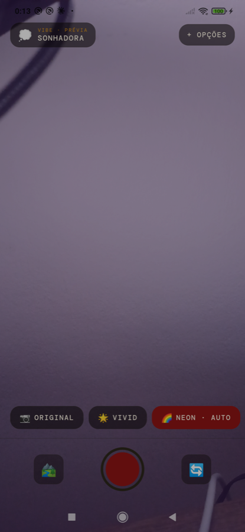
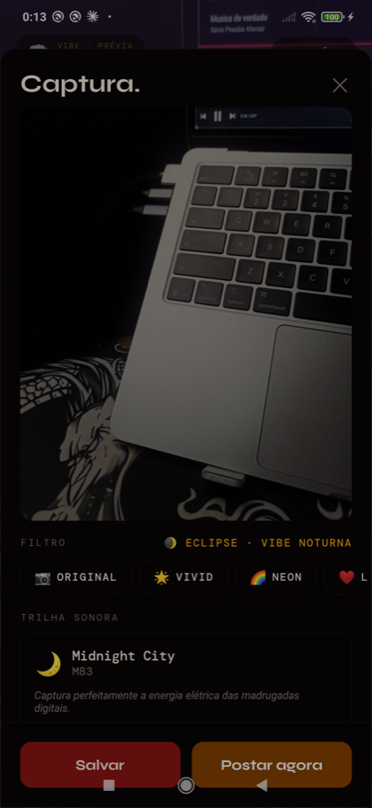
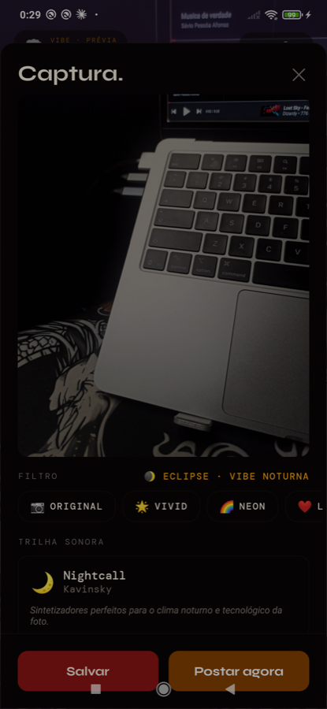

<div align="center">

# 🎨 Synesthesia — App

### Uma nova forma de ver o mundo através da câmera

[](https://www.fiap.com.br)
[](https://expo.dev)
[](https://reactnative.dev)
[](https://www.typescriptlang.org)

</div>

---

## 📖 Sobre

**Synesthesia** é o app mobile da equipe **SAVAC** para o **JOVI Challenge — FIAP 2026**. Ele redefine a câmera do smartphone como uma experiência **multimodal e contextual**: traduz automaticamente o contexto visual de uma cena em **filtros** e **trilha sonora** harmônicos, entregando um "pacote sensorial" (foto + filtro + música) pronto para compartilhar — com o mínimo de atrito de decisão.

Este repositório é a evolução **mobile (Expo / React Native)** do MVP funcional em terminal entregue na disciplina de Python. Os documentos-fonte de requisitos e arquitetura estão em [`docs/`](docs/).

## ✨ Pilares

1. **Inteligência Contextual e Adaptativa** — a "vibe" do visor é recalculada em tempo real (inclusive ao virar a câmera) e o filtro é aplicado ao vivo.
2. **Fusão entre Atmosfera e Som** — imagem e música formam um único pacote sensorial no momento da captura.
3. **Ciclo de Vida da Mídia** — galeria inteligente que preserva a intenção criativa: revisite, lapide e exporte.

## 📱 Preview

Capturas reais do app rodando em development build (Redmi Note 8 Pro, Android 10):

<div align="center">



</div>

<div align="center">
<sub><b>Visor ao vivo</b> — filtro aplicado em tempo real · <b>Captura</b> — Gemini lê a cena e define a vibe · <b>Trilha</b> — curadoria musical coerente com a atmosfera</sub>
</div>

No exemplo acima o Gemini leu *"laptop aberto em ambiente escuro, foco no teclado"*, classificou a vibe como **noturna**, aplicou o filtro **Eclipse 🌒** e sugeriu **Midnight City (M83)** — o pacote sensorial é exportado como um `.mp4` de 30s unindo imagem e trilha.

## 🚀 Como rodar (Expo Go)

Pré-requisitos: Node 20+, celular com o app **Expo Go** ([Android](https://play.google.com/store/apps/details?id=host.exp.exponent) / [iOS](https://apps.apple.com/app/expo-go/id982107779)) na mesma rede Wi-Fi do computador.

```bash
npm install
npx expo start
```

Escaneie o QR code exibido no terminal: no **Android**, pelo próprio app Expo Go; no **iOS**, pela câmera do sistema. Se a rede bloquear a conexão local (Wi-Fi corporativo/universidade), use `npx expo start --tunnel`.

Chaves de API são **opcionais** (o Deezer não exige chave): copie `.env.example` para `.env` para habilitar a curadoria via Gemini.

### ⚠️ Adaptações para Expo Go

O Expo Go não carrega módulos nativos fora do SDK. Para validação imediata no celular, esta versão substitui parte da stack final por equivalentes compatíveis, mantendo os contratos da arquitetura:

| Arquitetura final | Nesta versão (Expo Go) |
|---|---|
| `react-native-vision-camera` | `expo-camera` |
| ML Kit (rotulagem de cena on-device) | Vibe simulada on-device (`src/services/vibeEngine.ts`) — mesmo contrato `detectVibe() → Vibe` |
| Skia (shaders GPU) | Overlays + style `filter` do RN (GPU) |
| `ffmpeg-kit` (vídeo .mp4 imagem+áudio) | No Expo Go: imagem renderizada + áudio + legenda. No **development build**: `.mp4` real (ver abaixo) |
| `expo-av` | `expo-audio` (sucessor oficial) |

## 🎬 Development build (fluxo completo, com `.mp4`)

O `.mp4` único (imagem + trilha) exige código nativo e **só roda em development build** — no Expo Go o pacote degrada para imagem + áudio + legenda, sem nunca bloquear a postagem.

A geração usa o módulo local [`modules/video-muxer`](modules/video-muxer), construído sobre o **[Media3 Transformer](https://developer.android.com/media/media3/transformer)** do Google (H.264 + AAC) em vez do `ffmpeg-kit` previsto originalmente: entrega o mesmo resultado sem o peso do binário do FFmpeg e sem lidar na mão com as diferenças de encoder entre fabricantes.

```bash
# Requer Android SDK + JDK 17 (não precisa do Android Studio)
npm run android        # compila nativo e instala no device conectado
```

Utilitários de desenvolvimento em [`scripts/dev-android.sh`](scripts/dev-android.sh) (`build`, `log`, `shot`, `video`).

## 🛠️ Stack

`Expo` · `expo-router` · `TypeScript` · `react-native-vision-camera` · `react-native-skia` · `react-native-reanimated` · `react-native-mlkit-image-labeling` · `zustand` · `async-storage` · `@google/generative-ai` (Gemini) · `Deezer` · `Last.fm` · `expo-av` · `@gorhom/bottom-sheet` · `androidx.media3-transformer` · `expo-media-library` · `expo-sharing`

## 🎨 Identidade visual

| Token | Hex | Uso |
|---|---|---|
| Ruby | `#8D1514` | Primária / CTAs |
| Amber | `#F8A20D` | Acento / música |
| Ink | `#090506` | Fundo |
| Parchment | `#F5EEDE` | Texto claro |

Tipografia: **Syne** (display) + **DM Mono** (labels técnicas). Filtros: Vivid 🌟 · Neon 🌈 · Love ❤️ · Eclipse 🌒 · Retro 📼 · Vintage 🧡 · Arctic ❄️ · Honey 🍯.

## 🗂️ Estrutura

```
.
├── app/                          # Rotas (expo-router): permissões, câmera, galeria, ajustes
├── modules/video-muxer/          # Expo Module nativo: imagem + trilha → .mp4 (Media3 Transformer)
├── scripts/dev-android.sh        # Build/log/screenshot/pull no device via adb
├── src/
│   ├── components/               # CaptureSheet, MusicSheet, PostSheet, FilterCarousel, player...
│   ├── constants/                # 8 filtros + vibes
│   ├── services/                 # vibeEngine (contexto), music (Gemini/Deezer), mediaStorage
│   ├── stores/                   # zustand: ajustes, galeria, sessão de captura
│   └── theme/                    # Design tokens (ruby/amber/ink/parchment, Syne + DM Mono)
├── CLAUDE.md                     # Guia para agentes de código
├── docs/                         # Documentos-fonte (requisitos + arquitetura)
├── specs/001-synesthesia-mvp/    # Especificação (Spec Kit)
└── .specify/                     # Constituição, templates e workflow do Spec Kit
```

## 🚀 Desenvolvimento (Spec Kit)

O projeto é guiado por **[Spec Kit](https://github.com/github/spec-kit)**:

```
/speckit-constitution   → princípios do projeto (.specify/memory/constitution.md)
/speckit-specify        → especificação (specs/001-synesthesia-mvp/spec.md)
/speckit-plan           → plano técnico de implementação
/speckit-tasks          → tarefas acionáveis
/speckit-implement      → execução
```

## 👥 Equipe SAVAC

Ana Beatriz Da Cruz Silva (RM572278) · Arthur Carvalho Gomes Da Costa (RM570387) · Carolina Kiyomi Hada (RM571664) · Sávio Pessôa Afonso (RM570789) · Victor Paes Pontes (RM572781)

---

<div align="center">
Desenvolvido pela equipe <b>SAVAC</b> para o <b>JOVI Challenge — FIAP 2026</b>
</div>
